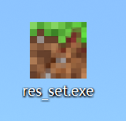
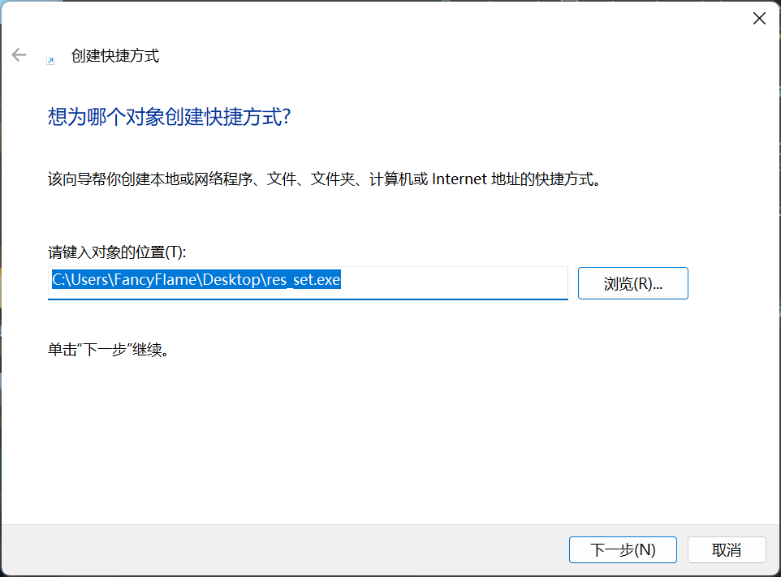
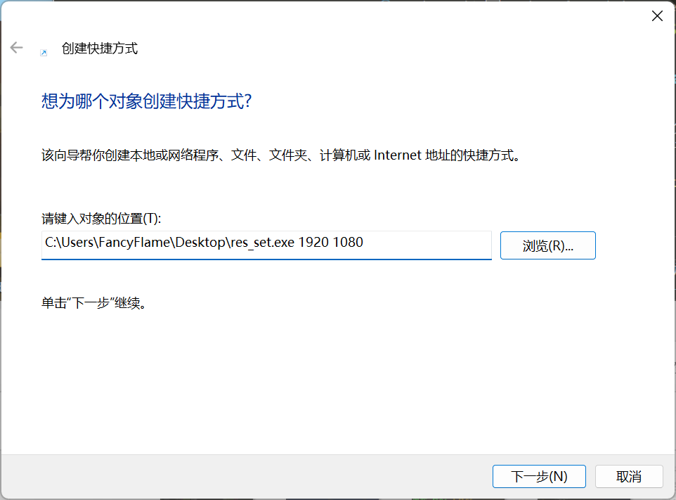
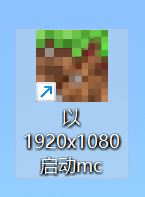

# Minecraft Resolution Setter

**仅支持Windows10 Minecraft使用。**

启动Minecraft并调整系统分辨率，在mc退出后调回原分辨率。因为4K屏跑光追实在是太卡了，所以写个程序帮我调分辨率。编译好的包在[release](https://github.com/Fancyflame/mc-resolution-setter/releases)里，需要自取。

## 用法
1. 下载可执行文件`res_set.exe`到任意地方
2. 右键桌面-新建-创建快捷方式
3. 找到文件路径，**不要点下一步**
4. 在尾部添加你的目标分辨率。例如你希望设置成`1920x1080`，则写成`C:\\路径\res_set.exe 1920 1080`
5. 输入快捷方式名字后点击下一步，完成创建
6. 双击快捷方式即可启动

启动后直接关闭窗口或在窗口内摁Ctrl+C也可以调回分辨率